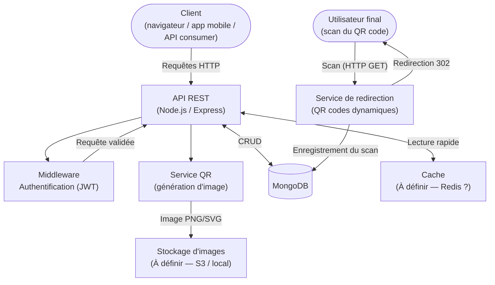

# Architecture technique — OpenQR

## Vue d'ensemble

OpenQR est une application web organisée en **architecture client-serveur**. Le cœur de la solution est une **API REST** qui expose les opérations de gestion de QR codes, s'appuie sur **MongoDB** pour la persistance des données, et intègre un service de génération d'images QR.

---

## Diagramme de flux (Mermaid)



---

## Composants principaux

### 1. API REST

- Point d'entrée unique pour toutes les opérations (gestion des QR codes, authentification, analytics)
- Gère la validation des données entrantes
- Applique l'authentification et les autorisations via un middleware JWT
- Délègue la logique métier aux services internes

**Technologies envisagées** : Node.js avec Express ou Fastify *(TODO : à confirmer)*

### 2. Service de génération QR

- Responsable de la génération des images QR à partir du contenu fourni
- Supporte différents formats de sortie (PNG, SVG)
- Applique les options de personnalisation visuelle (couleurs, logo, forme)
- Les images générées sont stockées dans un service de stockage externe ou local

**Librairies envisagées** : `qrcode`, `qr-image`, ou équivalent *(TODO : à confirmer)*

### 3. MongoDB

- Base de données principale du projet
- Stocke les entités : `QRCode`, `User`, `Scan`
- Utilisé pour les requêtes analytiques (agrégations sur les scans)

**Collections** :

| Collection | Description |
|---|---|
| `qrcodes` | Données des QR codes |
| `users` | Comptes utilisateurs |
| `scans` | Événements de scan |

### 4. Service de redirection (QR codes dynamiques)

- Endpoint dédié (`GET /r/:shortCode`) qui reçoit les requêtes de scan
- Enregistre les données de scan (horodatage, IP anonymisée, user-agent, localisation)
- Effectue une redirection HTTP 302 vers l'URL cible configurée
- Peut être indépendant de l'API principale pour une meilleure scalabilité

### 5. Middleware d'authentification

- Valide le token JWT fourni dans l'en-tête `Authorization`
- Injecte l'identité de l'utilisateur dans le contexte de la requête
- Applique les contrôles d'accès (un utilisateur ne peut accéder qu'à ses propres QR codes)

### 6. Cache *(À définir)*

- Mise en cache des images QR générées fréquemment
- Mise en cache des statistiques de scan agrégées

**Technologies envisagées** : Redis ou cache en mémoire *(TODO : à confirmer)*

### 7. Stockage d'images *(À définir)*

- Stockage persistant des images QR générées (PNG/SVG)

**Options envisagées** : Amazon S3, stockage local, ou CDN *(TODO : à confirmer)*

---

## Flux principaux

### Création d'un QR code

```
Client  →  POST /api/v1/qr  →  API
API     →  Valide les données
API     →  Appelle QRService.generate(content, customization)
            QRService → génère l'image → Storage
API     →  Persiste le QRCode dans MongoDB
API     →  Retourne { id, imageUrl, ... }  →  Client
```

### Scan d'un QR code dynamique

```
Utilisateur final  →  Scanne le QR code (GET /r/:shortCode)
Redirect Service   →  Recherche le QR code dans MongoDB
Redirect Service   →  Enregistre le Scan (IP anonymisée, user-agent, timestamp, localisation)
Redirect Service   →  Incrémente scanCount sur le QRCode
Redirect Service   →  HTTP 302 Redirect  →  URL cible
```

### Connexion utilisateur

```
Client  →  POST /api/v1/auth/login  →  API
API     →  Vérifie les credentials dans MongoDB
API     →  Génère un token JWT (signé, expirant)
API     →  Retourne { token, expiresAt, user }  →  Client
```

---

## Choix technologiques et justifications

| Choix | Technologie | Justification |
|---|---|---|
| Base de données | **MongoDB** | Schéma flexible adapté aux différents types de QR codes et données de scan. Excellentes performances pour les agrégations analytiques. |
| Format d'échange | **JSON** | Standard universel, lisible, compatible avec tous les clients |
| Authentification | **JWT** | Sans état (stateless), adapté à une API REST, facilement intégrable côté client |
| Versionnage API | `/api/v1/...` | Assure la rétrocompatibilité lors des évolutions de l'API |
| QR codes dynamiques | **Redirection HTTP 302** | Permet de modifier la destination sans regénérer le QR code physique |

---

## Déploiement *(À définir)*

> **TODO** : Définir la stratégie de déploiement (Docker, Docker Compose, Kubernetes, PaaS, etc.)

### Pistes envisagées

- **Docker Compose** pour le déploiement local (API + MongoDB + Redis)
- **Variables d'environnement** pour la configuration (connexion MongoDB, secret JWT, etc.)
- **CI/CD** via GitHub Actions *(TODO)*

### Variables d'environnement nécessaires *(liste préliminaire)*

| Variable | Description |
|---|---|
| `MONGODB_URI` | URI de connexion MongoDB |
| `JWT_SECRET` | Clé secrète pour la signature des tokens JWT |
| `JWT_EXPIRES_IN` | Durée de validité des tokens JWT (ex: `7d`) |
| `PORT` | Port d'écoute de l'API (défaut : `3000`) |
| `STORAGE_TYPE` | Type de stockage d'images (`local` ou `s3`) |
| `BASE_URL` | URL de base de l'application (utilisée pour générer les URLs de redirection) |

---

## Sécurité *(considérations principales)*

- Les mots de passe sont **hashés** avant stockage (bcrypt ou argon2)
- Les adresses IP sont **anonymisées** avant stockage dans les données de scan
- Les tokens JWT ont une **durée de vie limitée**
- Validation stricte de toutes les données entrantes
- Protection contre les injections NoSQL
- En-têtes de sécurité HTTP (CORS, HSTS, CSP, etc.) *(TODO : à implémenter)*
